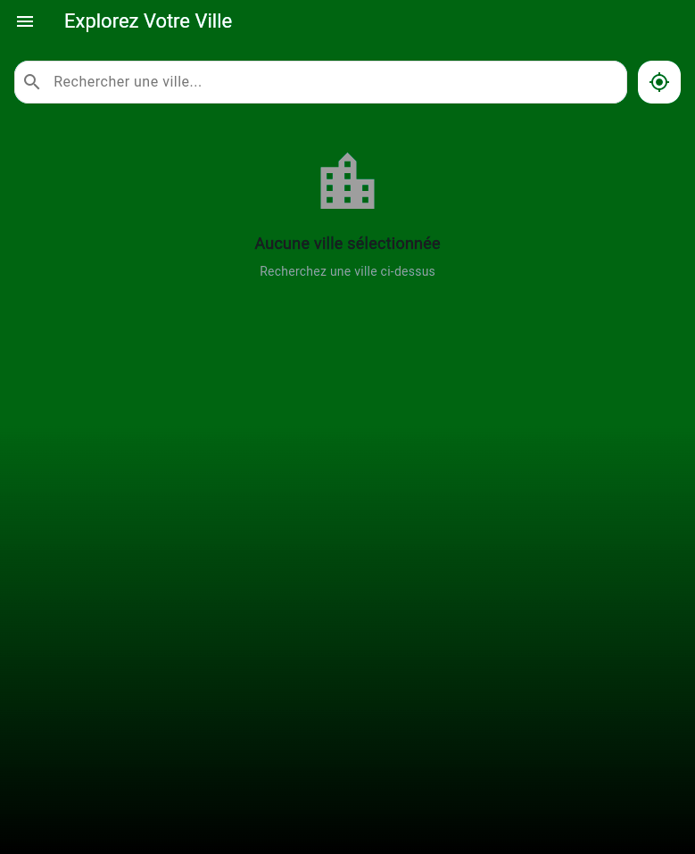
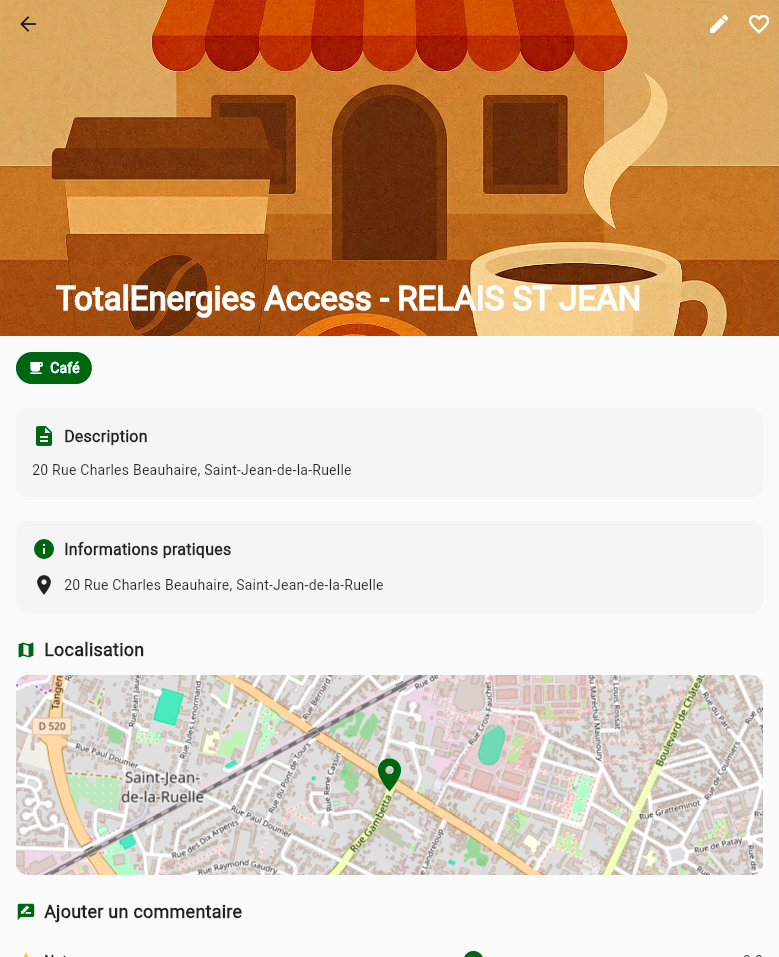
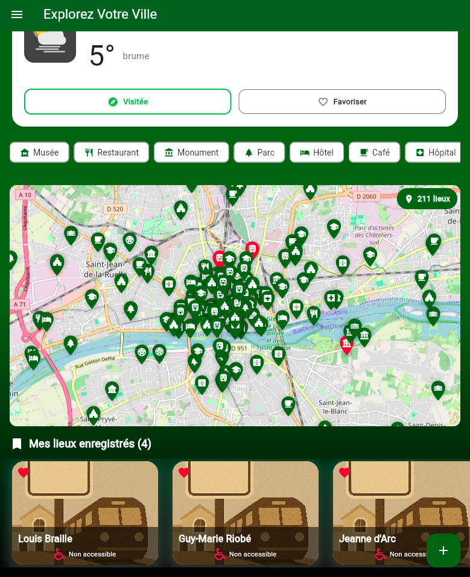
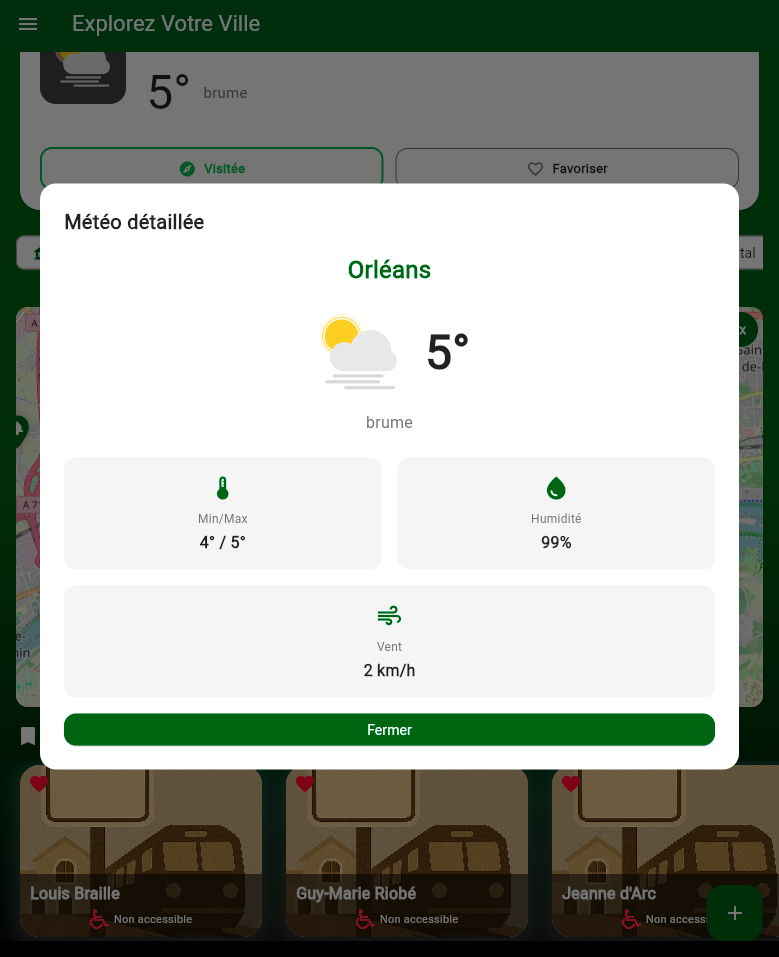
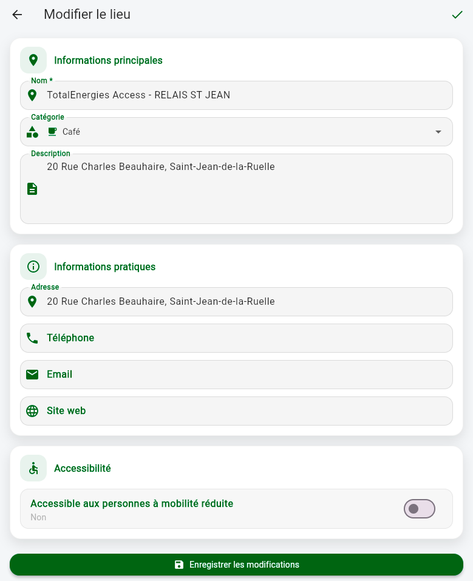
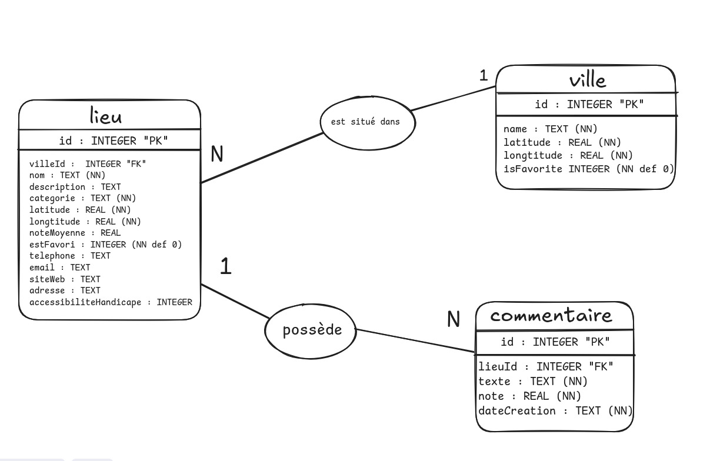

# Explorez Votre Ville

<div align="center">


**Application mobile de découverte et gestion de lieux favoris**

[Fonctionnalités](#-fonctionnalités) •
[Installation](#-installation) •
[Captures d'écran](#-captures-décran) •
[Architecture](#-architecture)

</div>

---

##  Description

**Explorez Votre Ville** est une application Flutter qui permet de découvrir, sauvegarder et commenter des lieux intéressants (restaurants, parcs, musées, cafés, monuments, etc.) dans n'importe quelle ville.

###  Fonctionnalités principales

-  **Recherche de villes** par nom ou géolocalisation GPS
-  **Météo en temps réel** pour chaque ville
-  **Découverte de lieux** par catégorie (restaurants, parcs, musées, etc.)
-  **Notation et commentaires** pour vos lieux favoris
-  **Carte interactive** avec tous vos lieux sauvegardés
-  **Création de lieux personnalisés** (domicile, travail, etc.)
-  **Mode sombre/clair** pour un confort visuel optimal
-  **Accessibilité PMR** indiquée pour chaque lieu

---

##  Captures d'écran

<div align="center">

| Écran d'accueil | Page principale | Détails d'un lieu |
|:---:|:---:|:---:|
|  |  |  |

| Liste de lieux | Météo détaillée | Modification |
|:---:|:---:|:---:|
|  |  |  |

</div>

Plus de captures disponibles dans le dossier [`assets/captures/`](assets/captures/)

---

##  Installation

### Prérequis

- **Flutter SDK** 3.0 ou supérieur
- **Dart** 2.17 ou supérieur
- **Android Studio** / **Xcode** (selon la plateforme)
- Clés API pour :
  - Google Places API
  - OpenWeatherMap API

### Étapes d'installation

1. **Cloner le repository**

```bash
git clone https://github.com/votre-username/explorez-votre-ville.git
cd explorez-votre-ville
```

2. **Installer les dépendances**

```bash
flutter pub get
```

3. **Configurer les clés API**

Créez un fichier `.env` à la racine du projet :

```env
GOOGLE_PLACES_API_KEY=votre_clé_google_places_ici
OPENWEATHERMAP_API_KEY=votre_clé_openweathermap_ici
```


4. **Lancer l'application**

```bash
# Mode debug
flutter run

# Mode release
flutter run --release
```

---

##  Architecture

### Stack technique

| Technologie | Usage |
|------------|-------|
| `provider` | Gestion d'état |
| `sqflite` | Base de données SQLite locale |
| `shared_preferences` | Stockage des préférences utilisateur |
| `flutter_map` | Carte interactive OpenStreetMap |
| `geolocator` | Géolocalisation GPS |
| `lottie` | Animations Lottie |
| `http` | Requêtes HTTP vers les APIs |
| `flutter_dotenv` | Gestion sécurisée des clés API |

### Structure du projet

```
lib/
├── db/                    # Helpers base de données
├── models/                # Modèles (Lieu, Ville, Commentaire, Météo)
├── providers/             # Providers (état global)
├── screens/               # Écrans de l'application
├── services/              # Services API (météo, ville, lieu)
├── utils/                 # Utilitaires
└── widgets/               # Composants réutilisables
    ├── carte/             # Widgets carte
    ├── commentaire/       # Widgets commentaires
    ├── lieu/              # Widgets lieux
    ├── menu/              # Widgets navigation
    ├── meteo/             # Widgets météo
    └── ville/             # Widgets ville
```

### Modèle de données

L'application utilise **SQLite** avec 3 tables principales :



- **Ville** : Stocke les villes favorites
- **Lieu** : Stocke les lieux avec leurs coordonnées et catégories
- **Commentaire** : Stocke les commentaires et notes des utilisateurs

### Navigation

```
/ (HomeScreen)
└── /main (MainScreen)
    └── /main/details/<lieu_id> (DetailsScreen)
        └── /main/details/<lieu_id>/modification (ModificationScreen)
```

---

##  Fonctionnalités détaillées

###  Recherche de ville

- Recherche par **nom** via l'API Nominatim
- Recherche par **géolocalisation GPS** automatique
- Sélection intelligente si plusieurs résultats
- Affichage météo : température (min/actuelle/max), état du ciel

###  Gestion des lieux

- **Ajout manuel** via formulaire personnalisé
- **Suggestions API** via Google Places
- **Sélection sur carte** pour la position exacte
- **Catégories** : Musée, Restaurant, Parc, Monument, Hôtel, Café, Bar, Cinéma, etc.
- **Modification** complète des informations
- **Suppression** avec confirmation

###  Carte interactive

- Affichage avec **OpenStreetMap** (flutter_map)
- **Marqueurs** pour tous les lieux enregistrés
- **Clic sur marqueur** pour ouvrir la fiche détaillée
- **Zoom et navigation** fluides

###  Commentaires et notes

- Système de notation de **0 à 5 étoiles**
- Ajout de **commentaires textuels**
- Historique des commentaires par lieu
- Calcul automatique de la **note moyenne**

### Animations

- **FadeIn/SlideIn** pour les listes de lieux
- **Hero transitions** entre liste et détail
- **Animations Lottie** pour météo et écran d'accueil
- **Animations fluides** sur les interactions

###  Thèmes

- **Mode clair** et **mode sombre**
- Basculement instantané
- Préférence sauvegardée
- Police personnalisée **Science Gothic** (écran d'accueil)

---

##  APIs utilisées

| API | Usage | Documentation |
|-----|-------|---------------|
| **Nominatim** | Recherche de villes | [nominatim.org](https://nominatim.org/) |
| **OpenWeatherMap** | Données météo | [openweathermap.org](https://openweathermap.org/api) |
| **Google Places** | Suggestions de lieux | [Google Places API](https://developers.google.com/maps/documentation/places/web-service) |

---

##  Organisation des fichiers

### Assets

```
assets/
├── categories/          # Images des catégories de lieux
├── meteo/              # Animations Lottie météo
├── fonts/              # Police Science Gothic
├── captures/           # Screenshots de l'application
└── *.json              # Animations Lottie (voiture, panorama)
```

### Providers

- `VilleProvider` : Gestion des villes et météo
- `LieuProvider` : CRUD des lieux
- `CommentaireProvider` : Gestion des commentaires et notes
- `ThemeProvider` : Basculement thème clair/sombre
- `SuggestionProvider` : Suggestions de lieux via API
- `HistoriqueProvider` : Historique des recherches

---


##  Problèmes connus

- La géolocalisation peut échouer si les permissions ne sont pas accordées
- Les suggestions de lieux nécessitent une connexion internet active
- Certaines villes peuvent ne pas avoir de données météo disponibles

---

---

##  Auteur

**Massinissa CHABANE **  
M1 Informatique - ARIAS  
Université d'Orléans

---


</div>
