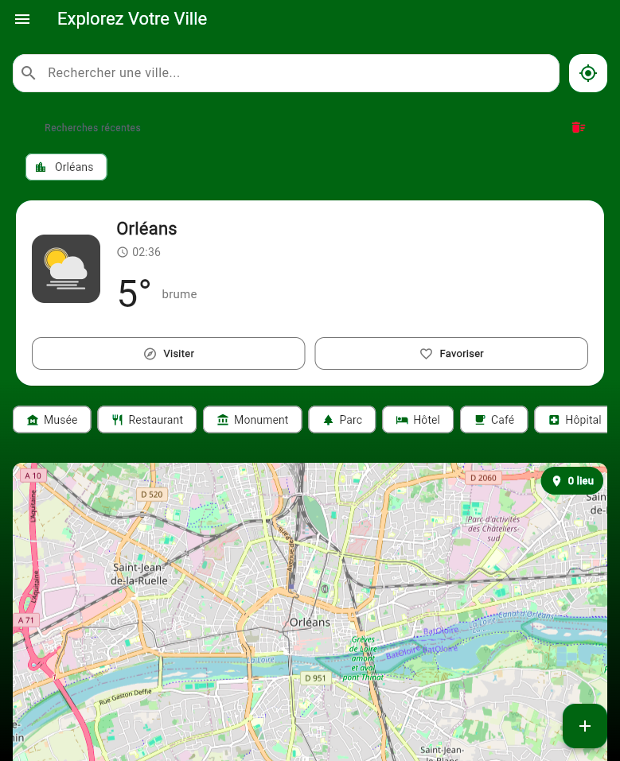
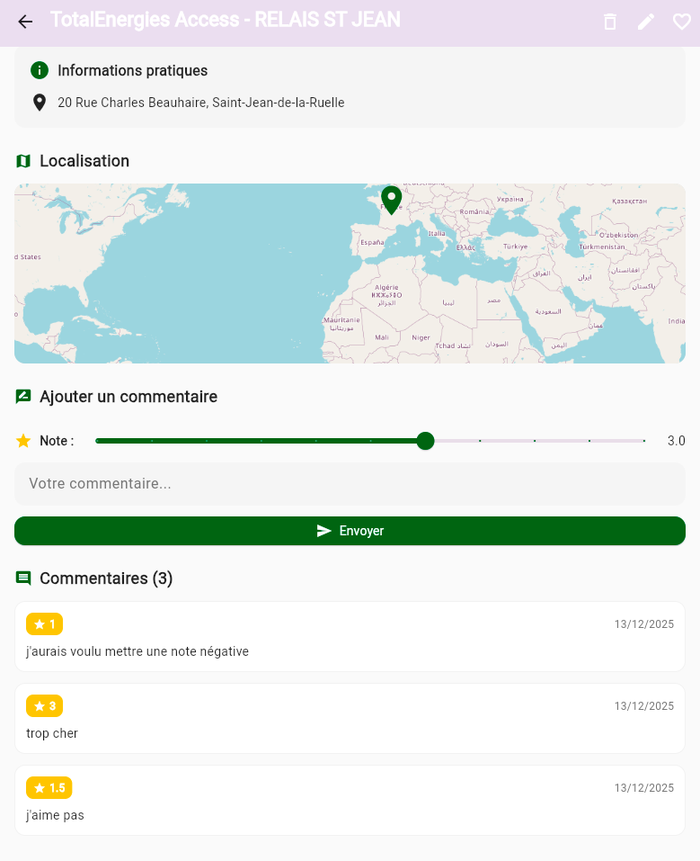
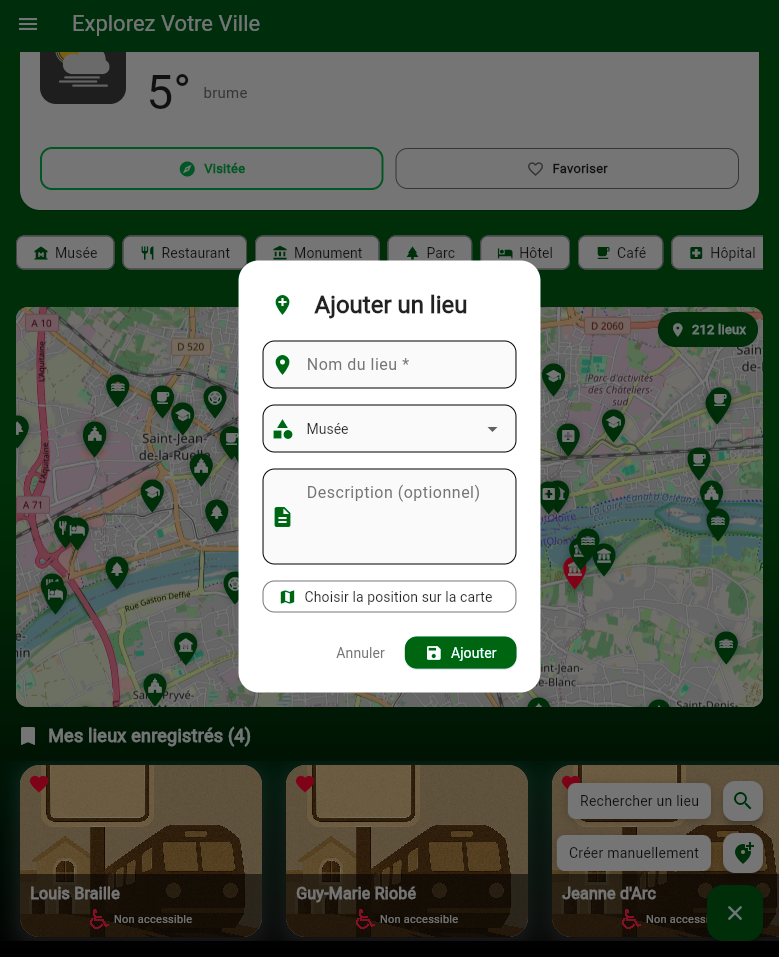

# Explorez Votre Ville

Application Flutter nommée ExplorezVotreVille permettant à un utilisateur de découvrir, sauvegarder et commenter des lieux intéressants (restaurants, parcs, musées, cafés, monuments, etc.) dans une ville au choix.

## Auteurs

- **Massinissa CHABANE**


---

## Description

**Explorez Votre Ville** est un application flutter qui permet à l'utilisateur de :

- Rechercher des villes par nom ou géolocalisation GPS
- Selectionner une ville au choix parmi plusieurs villes enregistrées et afficher ses détails météo
- Découvrir et sauvegarder des lieux par catégorie (parc , restaurants, musées ...)
- Modifier, noter, commenter un lieu
- Créer un lieu personnalisé (exemple : domicile)

---

## Structure du Projet

```
lib/
├── db    -> Helpers BDD
├── main.dart -> main
├── models -> modèle (Lieu, Ville, Commentaire, Météo)
├── providers -> providers (commentaires , historique de recherche, lieu, suggestions de lieux, theme, ville)
├── screens
│   ├── home_screen.dart -> HomeScreen (/) mène vers MainScreen
│   ├── main_screen.dart   -> MainScreen (/main) mène vers DetailsScreen
│   ├── details_screen.dart -> DetailsScreen de lieu (/main/details/<nom_du_lieu>) mène vers ModificationScreen ou en arrière
│   └── modification_screen.dart -> ModificationScreen de lieu (/main/details/<nom_du_lieu>/mdofication) revient en arrière
│
│
├── services  -> appels api (meteo,ville,lieu) + sharedPreferences
├── utils
│   ├── commun.dart
│   └── ville_loader.dart
└── widgets/
    ├── carte/                              -> Widgets liés à l'affichage et l'interaction avec les cartes
    │   ├── carte_des_lieux.dart            -> Affichage de la carte avec les marqueurs des lieux enregistrés
    │   ├── carte_interactive.dart          -> carte interactive de la ville + ses lieux
    │   └── selection_position_carte.dart   -> sélection d'une position sur la carte lors de l'ajout d'un lieu
    │
    ├── commentaire/                        -> Widgets pour la gestion des commentaires et notes
    │   ├── commentaire_form. dart           -> Formulaire d'ajout d'un commentaire avec note
    │   └── commentaire_liste.dart          -> Liste des commentaires d'un lieu
    │
    ├── lieu/                               -> Widgets pour l'affichage et la gestion des lieux
    │   ├── categories_filter_row.dart      # Barre de filtres par catégorie
    │   ├── lieu_card.dart                  # Card animée affichant un lieu (image, nom, note, accessibilité)
    │   ├── lieu_form.dart                  # Formulaire d'ajout manuel d'un lieu
    │   ├── lieu_search_dialog.dart         # Dialog de recherche de lieux via API
    │   └── liste_de_lieux.dart             # Liste scrollable des lieux d'une ville
    │
    ├── menu/                               # Widgets du menu et de la navigation latérale
    │   ├── app_drawer.dart                 # Drawer principal de l'application (menu)
    │   ├── header_section.dart             # En-tête du drawer avec infos utilisateur
    │   ├── rayon_recherche_section. dart    # Section de configuration du rayon de recherche
    │   ├── villes_dialog.dart              # Dialog d'affichage et sélection des villes enregistrées
    │   └── villes_list_section. dart        # Section listant les villes favorites dans le drawer
    │
    ├── meteo/                              # Widgets pour l'affichage météo
    │   ├── meteo_card.dart                 # Card météo (température, icône, état) + gestion de la ville
    │   └── meteo_details_dialog.dart       # Dialog avec détails météo (min, max, humidité, vent)
    │
    └── ville/                              # Widgets pour la recherche et sélection de villes
        ├── ville_historique.dart           # Affichage de l'historique des recherches de villes
        ├── ville_search_bar.dart           # Barre de recherche de ville (texte + bouton GPS)
        └── ville_selector_dialog.dart      # Dialog de sélection quand plusieurs villes correspondent

assets/
├── categories/ -> dossier images de card par catégories
├── meteo/ -> dossier animations lottie de météo
├── fonts/ -> police utilisée à l'introduction de l'appli
├── static_car.json -> animation lottie
├── moving_car.json
├── ville_panorama.json
└── handicap.png -> utilisée pour details de lieu
```

---

## Choix Techniques

### Dépendances Principales

- `provider` -> Gestion d'état
- `sqflite` -> Base de données SQLite locale
- `shared_preferences` -> Stockage des préférences utilisateur
- `flutter_map` -> Carte interactive OpenStreetMap
- `latlong2` -> Manipulation des coordonnées GPS
- `geolocator` -> Géolocalisation de l'appareil
- `lottie` -> Animations Lottie
- `animated_text_kit` -> Animations de texte
- `http` -> Requêtes HTTP vers les APIs
- `flutter_dotenv` -> pour les apiKyeys
- `url_launcher` -> Ouverture de liens externes

### Modèle de Données SQLite

L'application utilise 3 tables principales.


### Architecture Provider

L'application utilise plusieurs Providers pour la gestion d'état :

- `VilleProvider` -> Gestion des villes, ville actuelle, météo, ville mise en avant
- `LieuProvider` -> Gestion des lieux d'une ville (CRUD)
- `CommentaireProvider` -> Gestion des commentaires et notes
- `ThemeProvider` -> Basculement mode clair/sombre
- `SuggestionProvider` -> Suggestions de lieux via API externe
- `HistoriqueProvider` -> Historique des recherches

### APIs Utilisées

- **Nominatim** : Recherche de villes par nom ou coordonnées
- **OpenWeatherMap** : Données météorologiques
- **Google map Api** : Recherche de lieux

### SharedPreferences

Utilisé pour stocker :

- Mode thème (clair/sombre)
- ID de la ville mise en avant
- Historique des recherches récentes

---

## Fonctionnalités

### Ecran d'accueil

- Animation d'introduction avec Lottie
- Texte animé avec animated_text_kit
- Bouton "Commencer" vers la page principale

### Page principale

- Barre de recherche de ville (texte ou GPS)
- Affichage de la ville actuelle avec météo
- Liste des lieux favoris en cards animées
- FloatingActionButton pour ajouter un lieu

### Recherche de ville

- Recherche par nom via API
- Recherche par géolocalisation GPS
- Sélection parmi plusieurs résultats si nécessaire
- Affichage météo : température min/actuelle/max, état du temps

### Gestion des lieux

- Ajout manuel avec formulaire
- Sélection depuis suggestions API
- Choix de position sur carte
- Catégories : musée, restaurant, parc, monument, hôtel, café, etc.

### Page de détail

- Informations complètes du lieu
- Position sur carte
- Ajout de commentaires et notes
- Indicateur d'accessibilité PMR
- Animation d'apparition du contenu

### Carte interactive

- affhage avec flutter_map
- Marqueurs pour tous les lieux
- Clic sur marqueur pour ouvrir la fiche détaillée

### Animations

- FadeIn/SlideIn pour la liste des lieux
- Transition Hero entre liste et détail
- Animations Lottie pour météo et écran d'accueil
- Animation lors de l'affichage des détails météo

### Theme

- Mode clair et mode sombre
- Police personnalisée ScienceGothic ('écran d'accueil)

---

## Captures d'ecran
les captures d'ecran se trouve dans le dossier `assets/captures/`

### Ecran d'accueil


### Page principale


### Affichage de ville



## Liste de lieu


### Page de detail d'un lieu


### Commentaires de lieux


### Formulaire de création de lieu



### Dialog meteo detaillee


### Page de modification d'un lieu


---

## Installation

1. Installer les dépendances

```bash
flutter pub get
```

2. Lancer l'application

```bash
flutter run
```


!!! le fichier env est à renommer en .env 
